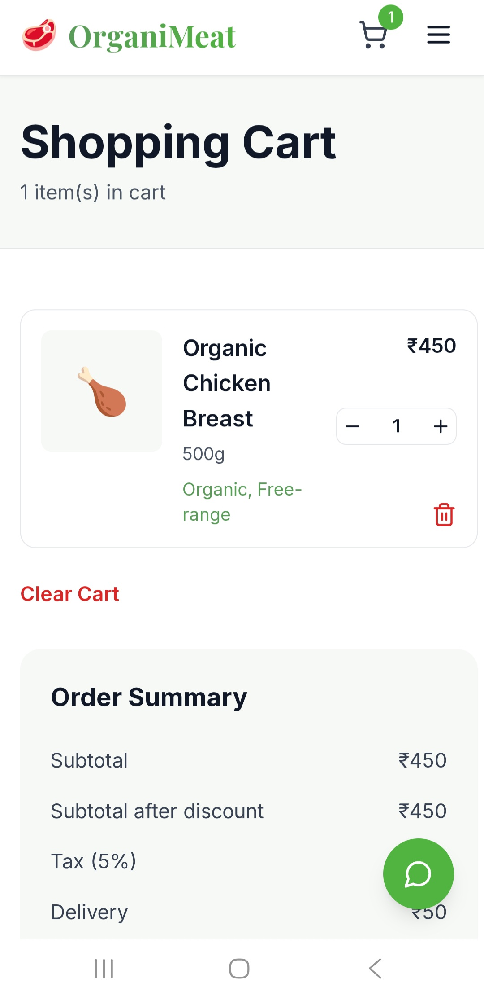
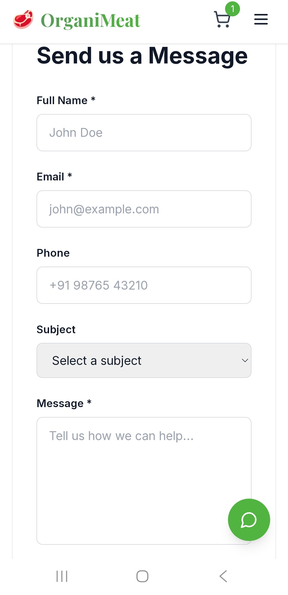

# OrganiMeat - Fresh Organic Meat Delivery Platform
## 📸 Screenshots

### Cart Page


### Contact Page

A modern, mobile-first e-commerce platform for purchasing premium organic, grass-fed, and sustainably-sourced meat in India. Built with Next.js 14, React 18, TypeScript, and Tailwind CSS.

## 🌿 Features

### 🏪 Core E-commerce
- **Product Catalog**: Browse 12+ premium organic meat products (chicken, mutton, fish, specialties)
- **Smart Filtering**: Filter by category, price range, and certifications
- **Shopping Cart**: Add, remove, and update quantities with persistent storage
- **Checkout**: Secure payment processing integration
- **Order Management**: Track orders in real-time

### 📦 Subscription Service
- **Flexible Plans**: Weekly, biweekly, and monthly subscription options
- **Customizable Boxes**: Choose products for each delivery
- **20% Savings**: Up to 20% discount on subscription vs. one-time purchases
- **Easy Management**: Pause, skip, or cancel anytime

### 🗺️ Order Tracking
- **Live GPS Tracking**: Real-time delivery location updates
- **Status Updates**: 5-stage order journey (Confirmed → Preparing → Quality Check → Out for Delivery → Delivered)
- **ETA Calculation**: Estimated time of arrival for deliveries
- **Map Integration**: Visual tracking with Leaflet maps

### 🤖 AI Chatbot
- **Customer Support**: 24/7 automated responses to FAQs
- **Product Recommendations**: Personalized meat suggestions
- **Order Assistance**: Help with ordering and delivery

### 📝 Feedback & Reviews
- **Customer Reviews**: 5-star rating system
- **Testimonials**: Showcase customer satisfaction
- **Feedback Collection**: Form to gather customer insights

### 🏢 Business Information
- **Transparency**: Display food safety licenses (FSSAI)
- **Farm Details**: Show sourcing information and certifications
- **QR Code Traceability**: Scan QR codes on meat packages to verify origin
- **Certifications**: Display organic, grass-fed, and sustainability badges

### 📱 Mobile Optimization
- **Responsive Design**: Works seamlessly on all devices
- **Mobile Payment**: UPI, cards, and digital wallets support
- **Fast Loading**: Optimized for low-bandwidth networks
- **Progressive Enhancement**: Works on older devices and browsers

## 🛠️ Tech Stack

### Frontend
- **Next.js 14**: React framework with server-side rendering
- **React 18**: UI library
- **TypeScript**: Type safety
- **Tailwind CSS**: Utility-first CSS framework
- **Framer Motion**: Smooth animations
- **Lucide React**: Beautiful icons
- **Zustand**: State management

### Backend Ready (Optional)
- **Node.js + Express**: REST API server
- **MongoDB**: NoSQL database
- **Stripe**: Payment processing

### Hosting
- **Vercel**: Frontend deployment
- **AWS/Heroku**: Backend hosting

## 📁 Project Structure

```
src/
├── app/                    # Next.js App Router pages
│   ├── layout.tsx         # Root layout with global styles
│   ├── page.tsx           # Landing page
│   ├── products/          # Product listing and filtering
│   ├── subscription/      # Subscription plans
│   ├── cart/              # Shopping cart
│   ├── contact/           # Contact form
│   ├── tracking/          # Order tracking
│   └── globals.css        # Global styles
│
├── components/
│   ├── layout/            # Navbar, Footer
│   ├── sections/          # Page sections (Hero, Products, etc.)
│   └── ui/                # Reusable UI components
│
├── lib/
│   ├── data.ts           # Mock data (products, orders)
│   └── utils.ts          # Utility functions
│
├── store/                # Zustand stores (cart, user, etc.)
├── types/                # TypeScript type definitions
└── public/               # Static assets

```

## 🚀 Getting Started

### Prerequisites
- Node.js 18+
- npm or yarn

### Installation

1. **Clone the repository**
   ```bash
   git clone <repository-url>
   cd organic-meat-shop
   ```

2. **Install dependencies**
   ```bash
   npm install
   ```

3. **Create environment variables** (optional)
   ```bash
   cp .env.example .env.local
   ```

4. **Run development server**
   ```bash
   npm run dev
   ```

5. **Open in browser**
   - Navigate to `http://localhost:3000`

### Build for Production
```bash
npm run build
npm start
```

## 📊 Key Components

### Pages
- **Home (/)**: Landing page with hero, featured products, testimonials
- **Products (/products)**: Full product catalog with filters
- **Subscription (/subscription)**: Subscription plan selection
- **Cart (/cart)**: Shopping cart and checkout
- **Contact (/contact)**: Contact form and business info
- **Tracking (/tracking)**: Order tracking with map

### Stores (State Management)
- **useCartStore**: Shopping cart state
- **useUserStore**: User authentication and profile
- **useOrderStore**: Order history and current order
- **useChatStore**: Chatbot messages
- **useFilterStore**: Product filtering preferences
- **useSubscriptionStore**: Subscription selection

### Utilities
- **formatCurrency()**: Format prices in Indian Rupees
- **formatDate()**: Format dates
- **calculateDiscount()**: Calculate discount amounts
- **isValidEmail(), isValidPhoneNumber()**: Form validation
- **generateOrderId()**: Create unique order IDs
- **timeAgo()**: Relative time display

## 💳 Payment Integration (Ready to Implement)

The project includes Stripe integration setup:
- Install Stripe SDK: `npm install stripe`
- Add Stripe API key to environment variables
- Implement checkout handler in API routes
- Configure webhook for payment confirmation

## 🌍 Localization (India Optimized)

- **Currency**: Indian Rupees (₹)
- **Phone Format**: +91 10-digit numbers
- **Postal Code**: 6-digit PIN codes
- **Languages**: Ready for Hindi/Tamil translation
- **Payment Methods**: UPI, cards, wallets (Google Pay, Apple Pay)

## 📈 Performance Optimization

- **Image Optimization**: Next.js Image component
- **Code Splitting**: Automatic by Next.js
- **CSS-in-JS**: Tailwind PurgeCSS
- **Caching**: Browser caching enabled
- **Lazy Loading**: Components load on demand
- **Mobile-First**: Fast on low-bandwidth networks

## 🔐 Security Considerations

- **Input Validation**: All forms validated
- **HTTPS**: Enable SSL/TLS in production
- **Environment Variables**: Sensitive data in .env
- **CORS**: Configure for API endpoints
- **XSS Protection**: React's built-in escaping
- **Rate Limiting**: Implement on APIs

## 📋 Future Enhancements

- [ ] User authentication system (login/signup)
- [ ] Admin dashboard for inventory management
- [ ] AI demand forecasting for inventory
- [ ] QR code scanner for product traceability
- [ ] Loyalty rewards program
- [ ] Multi-language support
- [ ] Push notifications
- [ ] Advanced order analytics
- [ ] Farm details page with live farm camera feeds
- [ ] Blog for organic meat recipes and tips

## 📞 Support

- **Email**: organicfreshmeat26@gmail.com
- **Phone**: +91 44 2786 9999
- **Hours**: 9am - 6pm IST, Monday - Friday

## 📄 License

This project is licensed under the MIT License - see LICENSE file for details.

## 👥 Team

Built with ❤️ by the OrganicFreshMeat team for health-conscious families in Tamil Nadu.

---

**Ready to launch?** Check out the deployment guide for Vercel or other hosting platforms.
